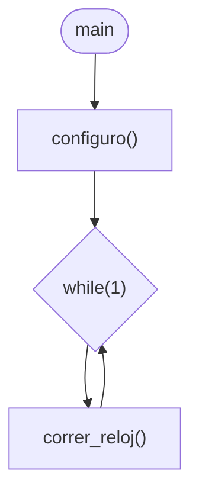
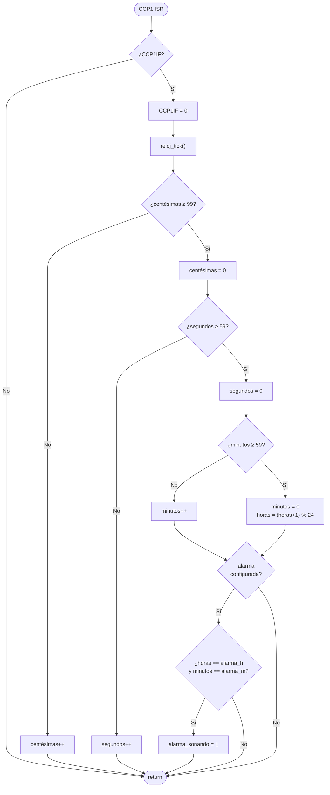
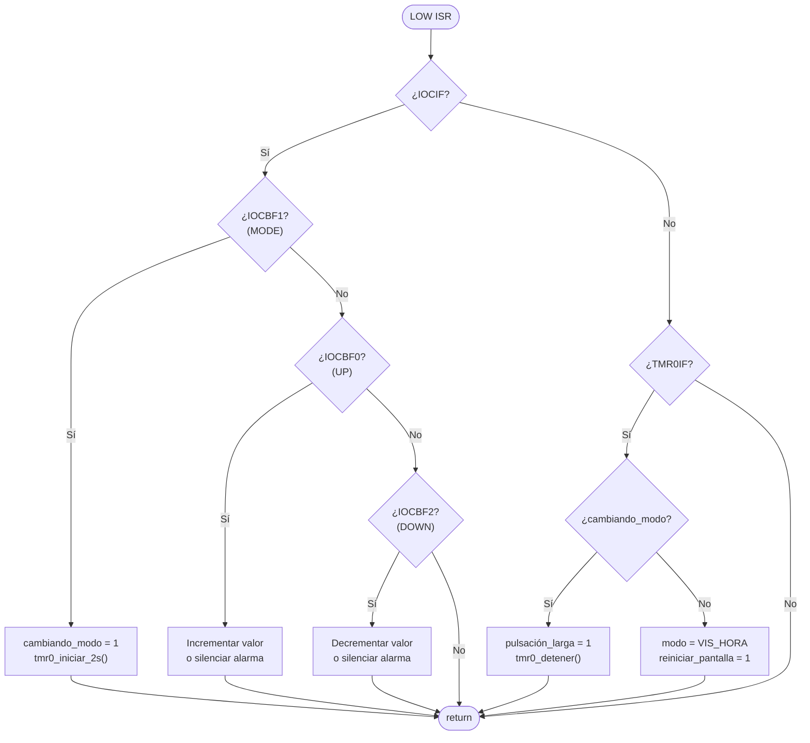
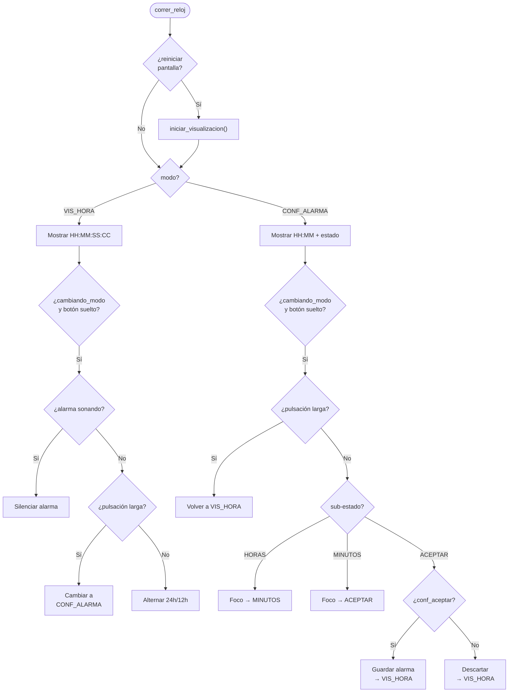

# PIC18F47Q10 – Reloj 24 H / 12 H con Alarma

> [!NOTE]
> Este proyecto forma parte de [**TheAssemblyChronicles-PIC**](https://remgo696.github.io/TheAssemblyChronicles-PIC/), una serie de proyectos, documentación y guías rápidas orientadas al aprendizaje de los microcontroladores PIC18F.
Puedes encontrar más proyectos [aquí](https://remgo696.github.io/TheAssemblyChronicles-PIC/proyectos/).

---

## Descripción del Proyecto

Se implementa un reloj digital con pantalla LCD 16 × 2 sobre el PIC18F47Q10, con dos modos de operación y tres botones de control. El reloj muestra la hora en formato `HH:MM:SS:CC` (horas, minutos, segundos, centésimas), permite alternar entre formato 24 h y 12 h (AM/PM), y cuenta con una alarma configurable.

Los tres botones, conectados a RB0–RB2 con pull-ups internos, son:

| Botón | Pin | Función |
|:------|:---:|:--------|
| **UP** | RB0 | Subir valor / desactivar alarma sonando |
| **MODE / Aceptar** | RB1 | Pulsación larga (≥ 2 s): cambiar modo. Pulsación corta: aceptar |
| **DOWN** | RB2 | Bajar valor / desactivar alarma sonando |

Los periféricos del PIC18F47Q10 utilizados son:

| Periférico | Función |
|:-----------|:--------|
| **Oscilador** | Reloj del sistema a 32 MHz |
| **TMR1 + CCP1** | Base de tiempo de 10 ms (centésimas de segundo) — ISR alta prioridad |
| **TMR0** | Medición de pulsación (2 s) y timeout de inactividad (6 s) — ISR baja prioridad |
| **IOC (PORTB)** | Detección de flancos de bajada en RB0–RB2 — ISR baja prioridad |
| **LCD 16 × 2** | Visualización de hora, modo y alarma |

<!-- La imagen se añadirá cuando esté disponible -->
<!--  -->

---

## Modos de Operación

### VISUALIZAR_HORA

Pantalla por defecto. Muestra la hora actual en la línea 2 del LCD:

```
Hora actual:   A     ← 'A' aparece si hay alarma activa
14:02:30:50 HS       ← formato 24 h
02:02:30:50 PM       ← formato 12 h
```

| Acción | Resultado |
|:-------|:----------|
| MODE corto (< 2 s) | Alterna entre formato 24 h y 12 h |
| MODE largo (≥ 2 s) | Cambia a modo CONFIGURAR_ALARMA |
| UP / DOWN / MODE (alarma sonando) | Silencia la alarma |

### CONFIGURAR_ALARMA

Permite configurar la hora de la alarma. El foco avanza secuencialmente: **Horas → Minutos → Aceptar**.

```
Conf. alarma:
14:03 HS              ← editando horas o minutos
14:03 HS  Acepto      ← sub-estado Aceptar
14:03 HS Rechazo      ← sub-estado Aceptar (rechazado)
```

| Acción | Resultado |
|:-------|:----------|
| MODE corto | Avanza el foco: Horas → Minutos → Aceptar |
| MODE largo (≥ 2 s) | Vuelve a VISUALIZAR_HORA sin guardar |
| UP | Incrementa valor del foco (o muestra "Acepto") |
| DOWN | Decrementa valor del foco (o muestra "Rechazo") |
| Timeout 6 s sin interacción | Vuelve a VISUALIZAR_HORA sin guardar |
| Aceptar en "Acepto" | Guarda la alarma y vuelve a VISUALIZAR_HORA |
| Aceptar en "Rechazo" | Descarta y vuelve a VISUALIZAR_HORA |

---

## Configuración del Reloj del Sistema (32 MHz)

Se utiliza el oscilador interno de alta frecuencia (HFINTOSC) a 32 MHz sin divisor.

### Registros del Oscilador

**OSCCON1** – Oscillator Control Register 1

| Bit | 7 | 6:4 | 3:0 |
|:---:|:---:|:---:|:---:|
| **Campo** | — | NOSC[2:0] | NDIV[3:0] |
| **Permisos** | — | R/W | R/W |

**OSCFRQ** – HFINTOSC Frequency Selection Register

| FRQ[2:0] | Frecuencia HFINTOSC |
|:--------:|:-------------------:|
| 000 | 1 MHz |
| 001 | 2 MHz |
| 010 | 4 MHz |
| 011 | 8 MHz |
| 100 | 12 MHz |
| 101 | 16 MHz |
| 110 | 32 MHz |
| 111 | 64 MHz |

**OSCEN** – Oscillator Enable Register

| Bit | 7 | 6 | 5 | 4 | 3 | 2 | 1:0 |
|:---:|:---:|:---:|:---:|:---:|:---:|:---:|:---:|
| **Campo** | EXTOEN | HFOEN | MFOEN | LFOEN | SOSCEN | ADOEN | — |
| **Permisos** | R/W | R/W | R/W | R/W | R/W | R/W | — |
| **Reset** | 0 | 0 | 0 | 0 | 0 | 0 | — |

### Valores seleccionados

| Registro | Valor | Justificación |
|:--------:|:-----:|:--------------|
| `OSCCON1` | `0x60` | NOSC = 110 (HFINTOSC), NDIV = 0000 (1:1) |
| `OSCFRQ`  | `0x06` | FRQ = 110 → 32 MHz |
| `OSCEN`   | `0x40` | HFOEN = 1 → habilitar HFINTOSC |

Con esta configuración, $F_{osc} = 32\ \text{MHz}$ y $F_{osc}/4 = 8\ \text{MHz}$.

```c
OSCCON1 = 0x60;  // HFINTOSC, sin divisor
OSCFRQ  = 0x06;  // 32 MHz
OSCEN   = 0x40;  // Habilitar HFINTOSC
```

---

## Configuración de Entradas (Botones)

Los tres botones se conectan a RB0, RB1 y RB2 como entradas digitales con pull-ups internos (activo bajo).

| Registro | Valor | Justificación |
|:--------:|:-----:|:--------------|
| `TRISB`  | `0x07` | RB0–RB2 como entradas, RB3–RB7 como salidas |
| `ANSELB` | `0xF8` | RB0–RB2 como digitales (bits 0–2 = 0) |
| `WPUB`   | `0x07` | Pull-ups habilitados en RB0–RB2 |

```c
TRISB  = 0x07;   // RB0-2 entradas
ANSELB = 0xF8;   // RB0-2 digitales
WPUB   = 0x07;   // Pull-ups en RB0-2
```

---

## Base de Tiempo: TMR1 + CCP1 (10 ms)

El reloj requiere una base de tiempo precisa de **10 ms** (centésimas de segundo). Se utiliza el módulo **CCP1 en modo comparación con reset de TMR1**: cuando TMR1 alcanza el valor de comparación, genera una interrupción y se reinicia automáticamente.

### Cálculos

Con $F_{osc}/4 = 8\ \text{MHz}$ y un prescaler de TMR1 de 1:8:

$$f_{TMR1} = \frac{F_{osc}/4}{Prescaler_{TMR1}} = \frac{8\,000\,000}{8} = 1\,000\,000\ \text{Hz}$$

El valor de comparación para un periodo de 10 ms:

$$CCPR1 = f_{TMR1} \times T = 1\,000\,000 \times 0{,}01 = 10\,000$$

$$10\,000 = \text{0x2710} \Rightarrow CCPR1H = \text{0x27},\quad CCPR1L = \text{0x10}$$

### Registros de TMR1

**TMR1CLK** – Timer1 Clock Source Selection

| TMR1CLK | Fuente |
|:-------:|:------:|
| 0x01 | $F_{osc}/4$ |

**T1CON** – Timer1 Control Register

| Bit | 7:6 | 5:4 | 3:2 | 1 | 0 |
|:---:|:---:|:---:|:---:|:---:|:---:|
| **Campo** | TMR1CS[1:0] | T1CKPS[1:0] | — | RD16 | TMR1ON |
| **Permisos** | R/W | R/W | — | R/W | R/W |

- `T1CKPS = 11`: prescaler 1:8
- `RD16 = 1`: lectura/escritura en modo 16 bits
- `TMR1ON = 1`: habilitar TMR1

### Registros de CCP1

**CCP1CON** – CCP1 Control Register

| Bit | 7 | 6 | 5 | 4 | 3:0 |
|:---:|:---:|:---:|:---:|:---:|:---:|
| **Campo** | EN | — | OUT | FMT | MODE[3:0] |
| **Permisos** | R/W | — | RO | R/W | R/W |
| **Reset** | 0 | — | x | 0 | 0000 |

- `EN = 1`: habilitar CCP1
- `MODE = 1011`: modo comparación con reset de timer

### Valores seleccionados

| Registro | Valor | Justificación |
|:--------:|:-----:|:--------------|
| `TMR1CLK` | `0x01` | Fuente = $F_{osc}/4$ |
| `T1CON`   | `0x33` | TMR1 ON, prescaler 1:8, RD16 = 1 |
| `CCP1CON` | `0x8B` | EN = 1, modo comparación con reset de TMR1 |
| `CCPR1H`  | `0x27` | Byte alto del valor de comparación (10 000) |
| `CCPR1L`  | `0x10` | Byte bajo del valor de comparación (10 000) |

```c
TMR1CLK = 0x01;   // Fuente: Fosc/4
T1CON   = 0x33;   // TMR1 ON, PSC 1:8, RD16=1
CCP1CON = 0x8B;   // CCP1 ON, compare mode con reset de TMR1
CCPR1H  = 0x27;
CCPR1L  = 0x10;   // Valor de comparación: 10 000
```

Cada 10 ms, CCP1 genera una interrupción de **alta prioridad** que incrementa las centésimas del reloj.

---

## Medición de Pulsación y Timeout: TMR0 (2 s / 6 s)

El TMR0 se configura en **modo 16 bits** con precarga. Cumple dos funciones:

1. **Pulsación larga (2 s):** al presionar MODE, se carga TMR0 con una precarga de 2 s. Si desborda antes de soltar el botón, se marca la pulsación como larga.
2. **Timeout de inactividad (6 s):** en modo CONFIGURAR_ALARMA, si no hay interacción durante 6 s, se vuelve automáticamente a VISUALIZAR_HORA.

### Cálculos

Con $F_{osc}/4 = 8\ \text{MHz}$ y un prescaler de 1:1024:

$$f_{TMR0} = \frac{F_{osc}/4}{Prescaler_{TMR0}} = \frac{8\,000\,000}{1\,024} = 7\,812{,}5\ \text{Hz}$$

**Para 2 segundos:**

$$Ticks_{2s} = f_{TMR0} \times 2 = 7\,812{,}5 \times 2 = 15\,625$$

$$Precarga_{2s} = 65\,536 - 15\,625 = 49\,911$$

**Para 6 segundos:**

$$Ticks_{6s} = f_{TMR0} \times 6 = 7\,812{,}5 \times 6 = 46\,875$$

$$Precarga_{6s} = 65\,536 - 46\,875 = 18\,661$$

### Registros del TMR0

**T0CON0** – Timer0 Control Register 0

| Bit | 7 | 6 | 5 | 4 | 3:0 |
|:---:|:---:|:---:|:---:|:---:|:---:|
| **Campo** | EN | — | OUT | MD16 | OUTPS[3:0] |
| **Permisos** | R/W | — | RO | R/W | R/W |
| **Reset** | 0 | — | 0 | 0 | 0000 |

- `EN = 0`: TMR0 inicia apagado (se enciende dinámicamente)
- `MD16 = 1`: modo 16 bits
- `OUTPS = 0000`: postscaler 1:1

**T0CON1** – Timer0 Control Register 1

| Bit | 7:5 | 4 | 3:0 |
|:---:|:---:|:---:|:---:|
| **Campo** | T0CS[2:0] | T0ASYNC | T0CKPS[3:0] |
| **Permisos** | R/W | R/W | R/W |
| **Reset** | 000 | 0 | 0000 |

| T0CS[2:0] | Fuente de reloj |
|:---------:|:----------------|
| 010 | $F_{osc}/4$ |

| T0CKPS[3:0] | Prescaler |
|:-----------:|:---------:|
| 1010 | 1:1024 |

### Valores seleccionados

| Registro | Valor | Justificación |
|:--------:|:-----:|:--------------|
| `T0CON0` | `0x10` | OFF inicialmente, 16-bit, postscaler 1:1 |
| `T0CON1` | `0x4A` | $F_{osc}/4$, síncrono, prescaler 1:1024 |

```c
T0CON0 = 0x10;   // 16-bit, OFF, postscaler 1:1
T0CON1 = 0x4A;   // Fosc/4, síncrono, PSC 1:1024
```

La precarga se escribe dinámicamente al iniciar una medición:

```c
#define TMR0_PRELOAD_2S  (65536u - 15625u)   // ≈ 2,0 s
#define TMR0_PRELOAD_6S  (65536u - 46875u)   // ≈ 6,0 s
```

---

## Configuración de Interrupciones (Dos Niveles de Prioridad)

El proyecto utiliza los dos niveles de prioridad del PIC18F:

| Prioridad | Fuente | Propósito |
|:---------:|:------:|:----------|
| **Alta** | CCP1 (cada 10 ms) | `reloj_tick()` — mantiene la hora exacta |
| **Baja** | IOC (botones) + TMR0 | Detección de pulsaciones y timeouts |

Separar las prioridades garantiza que el conteo de centésimas **nunca se atrasa**, incluso si la ISR baja está procesando botones.

### Registros de prioridad

| Registro | Valor | Justificación |
|:--------:|:-----:|:--------------|
| `IPR6bits.CCP1IP` | `1` | CCP1 = alta prioridad |
| `IPR0bits.IOCIP`  | `0` | IOC = baja prioridad |
| `IPR0bits.TMR0IP` | `0` | TMR0 = baja prioridad |

### Registros de habilitación

| Registro | Valor | Justificación |
|:--------:|:-----:|:--------------|
| `PIE6bits.CCP1IE` | `1` | Habilitar interrupción CCP1 |
| `PIE0bits.IOCIE`  | `1` | Habilitar interrupción IOC |
| `PIE0bits.TMR0IE` | `1` | Habilitar interrupción TMR0 |

### IOC – Interrupt-on-Change

| Registro | Valor | Justificación |
|:--------:|:-----:|:--------------|
| `IOCBN`  | `0x07` | Flanco de bajada en RB0, RB1 y RB2 |

> [!IMPORTANT]
> Los botones están activos en bajo (pull-ups internos). Se detecta el **flanco de bajada** (presionar). La acción se ejecuta al **soltar** el botón (en el main loop), lo que permite medir la duración de la pulsación.

### INTCON – Interrupt Control Register

| Bit | 7 | 6 | 5 | 4:0 |
|:---:|:---:|:---:|:---:|:---:|
| **Campo** | GIE/GIEH | PEIE/GIEL | IPEN | — |
| **Permisos** | R/W | R/W | R/W | — |

| Registro | Valor | Justificación |
|:--------:|:-----:|:--------------|
| `INTCON` | `0xE0` | GIE = 1, GIEL = 1, IPEN = 1 |

```c
/* Prioridades */
IPR6bits.CCP1IP = 1;   // CCP1 → alta
IPR0bits.IOCIP  = 0;   // IOC  → baja
IPR0bits.TMR0IP = 0;   // TMR0 → baja

/* Habilitación */
PIE6bits.CCP1IE = 1;
PIE0bits.IOCIE  = 1;
PIE0bits.TMR0IE = 1;
IOCBN = 0x07;           // Flanco de bajada en RB0–RB2

/* Global */
INTCON = 0xE0;           // GIE, GIEL, IPEN habilitados
```

---

## Biblioteca LCD 16 × 2

La interfaz con el LCD se realiza mediante la biblioteca LCD1602 en modo 4 bits. La documentación y el código fuente se encuentran en:

**[LCD1602 — Biblioteca para LCD 16 × 2](https://github.com/remgo696/TheAssemblyChronicles-PIC/tree/main/Librerias/LCD1602)**

En este proyecto se configura con:

| Parámetro | Valor |
|:---------:|:-----:|
| Puerto de control (RS, RW, E) | PORTC (bits 0–2) |
| Puerto de datos (D4–D7) | PORTD (bits 4–7) |

---

## Programa

### Descripción general

El programa se divide en tres archivos: `main.c` (punto de entrada), `reloj.c` (lógica del reloj) y `reloj.h` (definiciones y tipos).

La **rutina principal** configura el oscilador e inicializa los periféricos llamando a `iniciar_reloj()`. Luego entra en un bucle infinito que invoca `correr_reloj()` en cada iteración, donde se actualiza el LCD y se procesan las acciones de los botones en el main loop (nunca desde una ISR).

La **ISR de alta prioridad** (CCP1) se dispara cada 10 ms y llama a `reloj_tick()`, que incrementa centésimas → segundos → minutos → horas y verifica si la alarma debe sonar.

La **ISR de baja prioridad** atiende dos fuentes:
- **IOC:** al presionar un botón, activa flags (`b_cambiando_modo`, valores temporales, etc.).
- **TMR0:** al desbordar, marca la pulsación como larga (2 s) o activa el retorno por timeout (6 s).

> [!WARNING]
> Ninguna función del LCD se invoca desde una ISR. Las ISR solo modifican flags; el main loop los lee y ejecuta las operaciones de pantalla. Esto evita condiciones de carrera entre las escrituras al LCD del loop principal y las de la ISR.

### Rutina principal



### ISR alta prioridad (CCP1 — cada 10 ms)



### ISR baja prioridad (IOC + TMR0)



### Lógica del main loop (correr_reloj)



---

## Licencia

Este proyecto se distribuye bajo la licencia [MIT](LICENSE).
